# Game Basic Information #

## Summary ##

    Due Tonight is an one-on-one fighting game based on two teams of professor and student. 
    Students from UC Davis are under great study pressure, so they want to fight with professors 
    in order to get an extension for their homework. But professors should avoid that happens. 
    Characters have different attack skills which may come from some personal characteristics 
    in reality. This game is connected to our daily lives, especially those students and professors
    from UCD Computer Science department.

## Gameplay explanation ##

* Core game mechanics: This game needs two players for each round. The basic action includes attacking, protecting, jumping.
* Goals: Players who choose student team need to defeat professor team to win an extension for homework. 
* Controls:

    Xbox Controller(recommend):
    
        Left Stick, Left bumper, Right bumper for movement.
        
        'A' for shield skills, 'Y' and 'B' for two attack skills.
        
        'X' for extra attack skills(only available to certain characters).
    
    Keyboard:
    
        Left Player:
        
            'W''A''S''D' for movement.
            
            Left Shift and Control for two attack skills.
            
            Option for shield skills.
            
            Space for extra attack skill.
            
        Right Player:
        
            '⬆️''⬇️''⬅️''➡️' for movement.
            
            'J' and 'K' for two attack skills.
            
            'L' for shield skills.
            
* Each character has at least two attack skills and one sheld skill.
* Players should follow the steps of menu. Choosing one character from each team, and then choose a background to start fighting. Each round has 100 seconds to fight. If one of them dies, this round will end immediately. Players can decide whether to play again or quit game.

# Main Roles #

* Animation and Visuals :     Ruike Qiu
* Game Logic :               Bingwei Wang
* User Interface :            Jinghan Zhang
* Input :                     Zheng Wang
* Movement/Physics :          Jason Zhou

Your goal is to relate the work of your role and sub-role in terms of the content of the course. Please look at the role sections below for specific instructions for each role.

Below is a template for you to highlight items of your work. These provide the evidence needed for your work to be evaluated. Try to have at least 4 such descriptions. They will be assessed on the quality of the underlying system and how they are linked to course content. 

*Short Description* - Long description of your work item that includes how it is relevant to topics discussed in class. [link to evidence in your repository](https://github.com/dr-jam/ECS189L/edit/project-description/ProjectDocumentTemplate.md)

Here is an example:  
*Procedural Terrain* - The background of the game consists of procedurally-generated terrain that is produced with Perlin noise. This terrain can be modified by the game at run-time via a call to its script methods. The intent is to allow the player to modify the terrain. This system is based on the component design pattern and the procedural content generation portions of the course. [The PCG terrain generation script](https://github.com/dr-jam/CameraControlExercise/blob/513b927e87fc686fe627bf7d4ff6ff841cf34e9f/Obscura/Assets/Scripts/TerrainGenerator.cs#L6).

You should replay any **bold text** with your relevant information. Liberally use the template when necessary and appropriate.

## User Interface

The user interface of Due Tonight is designed and developed according to the basic game logic. The game is composed of six scenes that connected by scripts. The standard resolution we used is 1600 * 900.
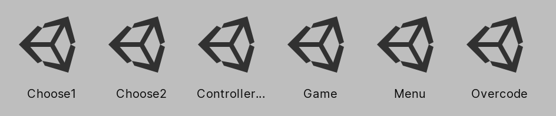
 * Scene1: Main Menu: contains Start , Quit, Overcode, Controller & Keyboard four buttons.
 
      * 'Start' is the link to next game scene which allow players to choose two characters.
      * 'Controller & Keyboard' can link to the controller and keyboard guide scene.
      * 'Overcode' can link to team roles page.
      * 'Quit' is to quit game.
 
  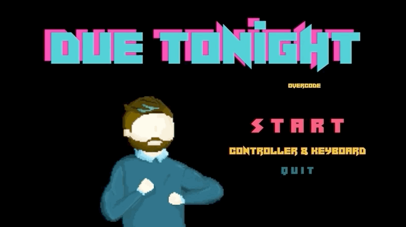
  
 Each button has different colors and effects.
 * Scene2: Choose two characters, and go to next scene. Save player's choices for Scene4.
 * Scene3: Choose background, and go to next scene. Save player's choice for Scene4.
 * Scene4: Game scene, connected with Scene3. There is a timer of 100 seconds and two healthbar for this scene. Healthbars and characters will appear according to players' choices from scene2 and 3. We used images to make the color of healthbar and it will change according to the remaining of characters' health. After one round ends, this scene also can back to Scene2 for players to play again and make their choices of characters and background, or back to the main menu of Scene1 and quit the game. If one player is die before the timer stops, this round will end immediately with a big K.O image. And we also included a 'draw' image for different cases. 
 * Scene5: Team credit page, connected with Main Menu. This page has a simple layout to show the main roles and sub roles of our team.
 * Scene6: 'Controller & Keyboard', connected with Main Menu.
 
 [UI script example](https://github.com/M2neko/ECS_189L_Final_Project/blob/5e299246b82745e5bb877facb62f7c7dab997bbf/Overcodeeeeeeee/Assets/Script/UI_Script/Game.cs#L1-L126)
 
 [Contributors: Jinghan Zhang, Zheng Wang]
 
## Movement/Physics

* As a fighting game, characters in the game must have basic movements for left, right, jump and squat down to avoid attack. The command pattern exercise in exercise 1 help us to separate movement for each button. There are two scripts, PlayerController and Player2Controller use to control the different characters in left and right. Each character has different skills, so each of them has script to manage the physics and motion. In order to improve the diversity of the player experience, the motion direction, force, duration time and some other factors are all various. For example the Rushbike skill for Butner, basically is adding certain force to the rigidbody and transform its position during the process. [Scipt RushBike.cs](https://github.com/M2neko/ECS_189L_Final_Project/blob/f56a53ae7db1aa7fc21f237ca9a6ae091fc1b7d7/Overcodeeeeeeee/Assets/Script/Butner_Motions/RushBike.cs#L1-L55)

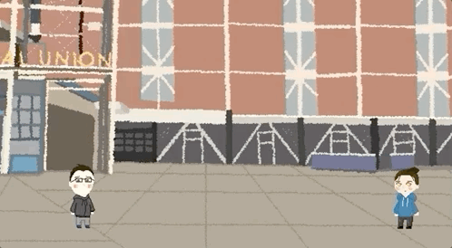

* We use the build in add velocity to move the character left and right. And we use add force to make the player jump although that looks weird, it works fine! And shooting prefab, I chose to move the transform position of the prefab to move more smoothly. That's mostly standard physics model i believe, but I think the most interesting part is that we simulated the thunder motion by fliping the x axis and y axis 2 times per frame which would make thunder look real. 

* In the system of game damage, we use the collision as the way to check whether the character hit each other successfully. 
This an efficient way for the checking of damage, but it also make the character 'Zee' too powerful [Script of Zee](https://github.com/M2neko/ECS_189L_Final_Project/blob/f56a53ae7db1aa7fc21f237ca9a6ae091fc1b7d7/Overcodeeeeeeee/Assets/Script/Zee_Motions/PerformSword.cs#L1-L67), since checking will happen at the whole time that 'Zee' using the sword skills and we make the scale of the skill objects a little large, some times people cannot tell whether they were hit. Since we need to check the collision, we also add mass on each character. And we need to add a floor at the bottom of the background to prevent the charactor from falling down.

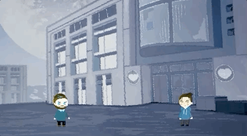

* For basic physics we used Rigidbody2D like the exercise 1 did which could provide us basic physics like the gravity, and we set the z rotation to be frozen, and because we are using add force to simulate the jump of the player, we can just modify the mass and gravity scale in Rigidbody2D which could directly change the ratio that player jump and the time they return to ground.

* We also keep the projectiles and other ability that player generate be on the top layer which will avoid it be covered by either the background or the player

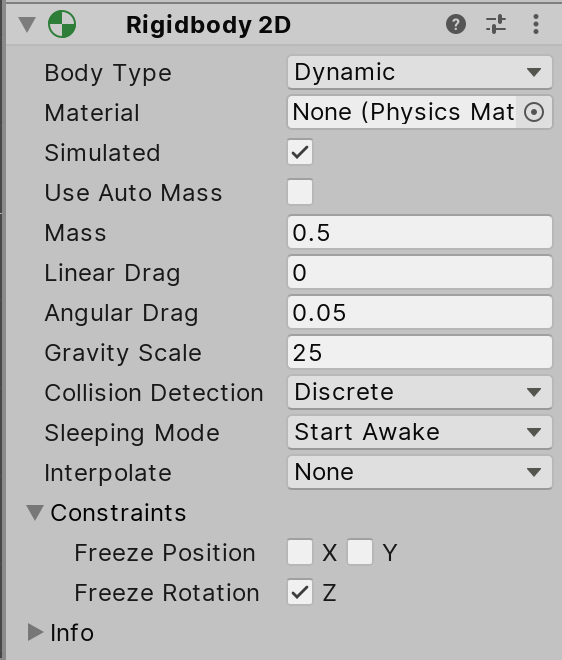

 [Contributors: Jason Zhou, Bingwei Wang]
 
## Animation and Visuals

* We chose to use 2D pixel art for our game and it has a simple, retro type of feel for video game. The overall scene with graphic design elements is interact with players efficiently. According to narrative design, the story of this game is happened in the campus of UC Davis, so the two backgrounds are inspired by the buildings of campus, Memorial Union and the Shield's Library. The four characters are based on McCoy, Zee, Butner, and one normal student. The graphic design is composed of UI elements like buttons, texts and images.
* The art of Due Tonight are designed and created by Jinghan Zhang.
* The free font we used for our game: [Noise Machine by Darrell Flood](https://www.fontspace.com/category/electric)
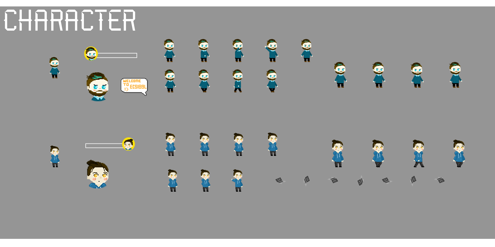
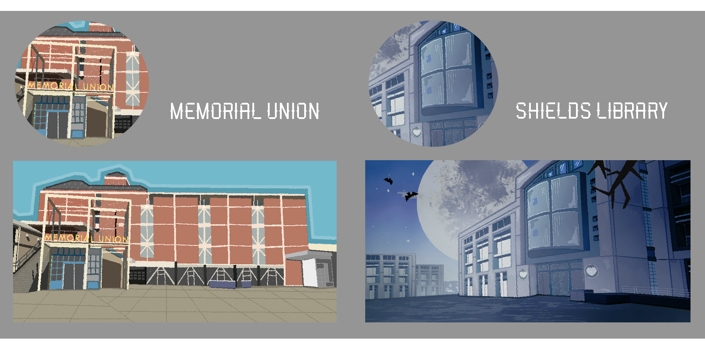
* Ruike Qiu and Jason Zhou worked together to finish the basic movement and the animation which would make the movement animation smooth because we need to make the time when to change the image of the character accurate. All characters have different animation controllers in Unity due to large amount of actions and movements. This part also need great team work to cooperate with the Movement/Physics and Input people.
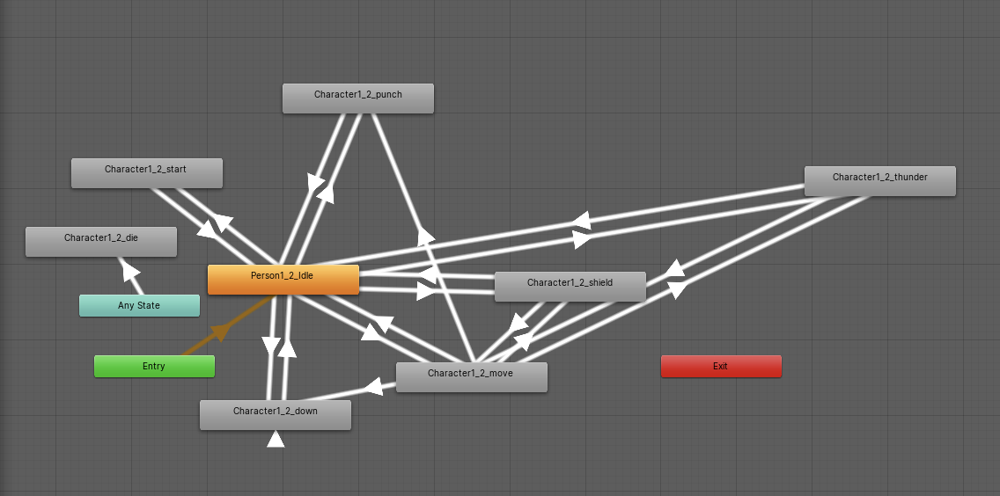

[Contributors: Ruike Qiu, Jason Zhou, Jinghan Zhang]

## Input

* As a fighting game, the input button is critical to players' overall gaming experience. Because we created four basic movements to each characters, and at least two attack skills and one shield skills, there are many buttons players need to use during the battle. Keyboard is not a recommended choice for control since one keyboard for two players to use at the same time are too small. So we changed the setting of Xbox controller and connect it with our game to improve user experience. 
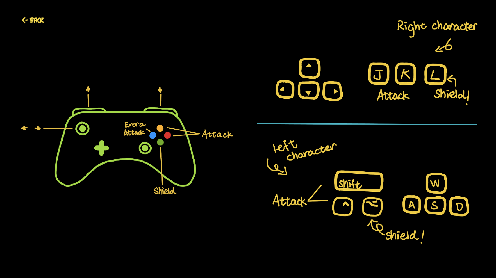
* The image above is the default input configuration. Players can check the Controller & Keyboard scene from the Main menu. We only can use left mouse button to click on the screen to change scenes and choose characters or background of battle.

 [Contributors: Zheng Wang, Bingwei Wang]
 
## Game Logic

* General: For a fighting game, the basic components includes characters, background, healthbar and a timer. Movement and damage is critical to game experience.
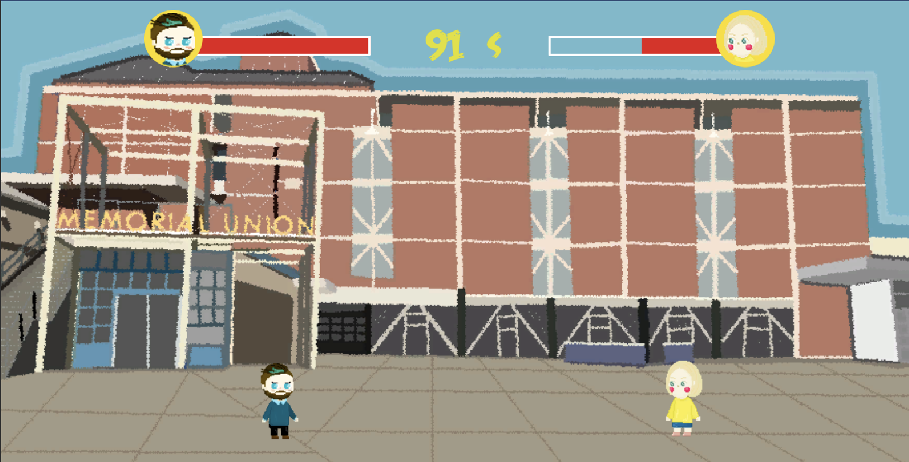
* Scene: There are six scenes overall. Players can interact with scene2 and scene3 to choose their characters and background. And then go to scene 4 for fighting. 
* Timer: We chose 100s as the duration for one round, according to some classical fighting games.
* Game manager: The most important game logic in our game is to decided various results of the battle, deciding the winner, K.O or draw. I used several SerializeField to managed different game objects. And I list many cases to display different images and declare winner. This part is finished in [EndGame.cs](https://github.com/M2neko/ECS_189L_Final_Project/blob/e24b55683341bb6b5205ebb09476c874e7503a91/Overcodeeeeeeee/Assets/Script/EndGame.cs#L1-L106).
* Skill: I decided to give each character two skills in order to make our game more worth playing. Also they have one shield skills to reduce damage which is controlled by the shield multiplier. Character 'Zee' is more powerful than others because I used [Random.Range](https://github.com/M2neko/ECS_189L_Final_Project/blob/e77f2d826e6e4ff1fd36407a485e47eac3af8894/Overcodeeeeeeee/Assets/Script/Damage.cs#L53-L58) to make her sword skill has the opportunities to have higher damage than normal. Some other skills' damage might have small adjustment because of the [Random.Range](https://github.com/M2neko/ECS_189L_Final_Project/blob/e77f2d826e6e4ff1fd36407a485e47eac3af8894/Overcodeeeeeeee/Assets/Script/Damage.cs#L66-L78) as well.  
* Healthbar and Damage: These are the two main parts which will influence our fhghting game. We used the object pooling method
we learned from exercise 5 to finish butner's shoot gate ability. And we designed a damage engine with serilizedfield of each 
damage for different ability which would allow us to test the game and modify to balance the player. And we keep tracking the
healthbar controller to see if there's a winner for the whole game logic.
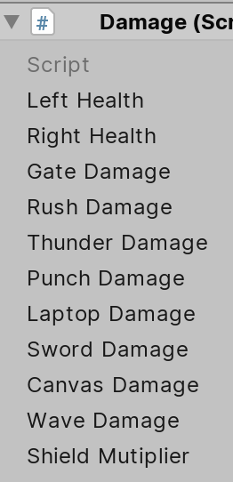
The script is [Damage.cs](https://github.com/M2neko/ECS_189L_Final_Project/blob/e24b55683341bb6b5205ebb09476c874e7503a91/Overcodeeeeeeee/Assets/Script/Damage.cs#L1-L115)

 [Contributors: Bingwei Wang, Ruike Qiu]

# Sub-Roles

* Gameplay Testing :          Zheng Wang
* Press Kit and Trailer :     Bingwei Wang
* Audio :                     Jinghan Zhang
* Narrative Design :          Ruike Qiu
* Game Feel :                 Jason Zhou

## Audio

* The background music is a cyberpunk style clip. This clip contains strong rhythm and suitable for a fighting game atmosphere.
 (1) [ Amoebacrew - Cyberpunk https://youtu.be/Ju8z7Ecp1iY ]
* Special thanks to Professor McCoy and Zee for their contribution for recording audio. Those audios from McCoy and Zee are applied to opening animations and attack skills.
  Other audio sources for characters come from the website (2) [Free Sound Effects https://www.freesoundeffects.com]
* Implementation: Add audio listener to gameobjects and evoke specific audio clips when the game receive different inputs.
Save all the audio files in scripts as [AudioSource](https://github.com/M2neko/ECS_189L_Final_Project/blob/a44591bf4ce994b135ce62f3261ba819591c93f1/Overcodeeeeeeee/Assets/Script/EndGame.cs#L49), and the volume can be adjusted. The function from component can used to control the play and stop of audio. If the audio will have a delay with the effect we need, we can make the audio play a little earlier to solve this problem. For the background music, because it will not stop unless players quit game, I used [DontDestroyOnLoad](https://github.com/M2neko/ECS_189L_Final_Project/blob/5e299246b82745e5bb877facb62f7c7dab997bbf/Overcodeeeeeeee/Assets/Script/UI_Script/BgMusic.cs#L30) to make the music keeps playing.

## Gameplay Testing

* Link to test result: https://github.com/M2neko/ECS_189L_Final_Project/blob/master/Gametesting.pdf

* Summarize
    * Most participants like our animation and character design. 
    * The game balance system still need to justify, some characters are too powerful, and some of them are too weak.
    * Some movements look weird, we may need other physical functions to fix them.

## Narrative Design

"Due Tonight" is a 2D retro style one on one fighting game. College students are under great preasure of several due everyday, so they want to fight to change their destiny, get an extention for their homework. 
* The sub-role of the narrative design was essentially make our final demo has a more clear connection to evoke players' interests. After we decided to make a fighting game, the way we underscore the narrative in our game is setting the background in our campus, and dividing players into two groups which one of them are students while the other are professors which follow the narrative that students fight against professors for extension. And we recorded the voice line from professor mccoy and zee which makes the narrative more reliable.We also combine the elements of due(Canvas) into the students' ability and the Logism(form ecs154) into butner(who taught that class)'s ability. When we declare the winner, if the student K.O professor, we would display the text that students do not need to submit their ex5 today. On the contrary, if the professor K.O student, we would display that students need to finish homework tonight. The characters, background, and short texts all provide supports for the narrative design.
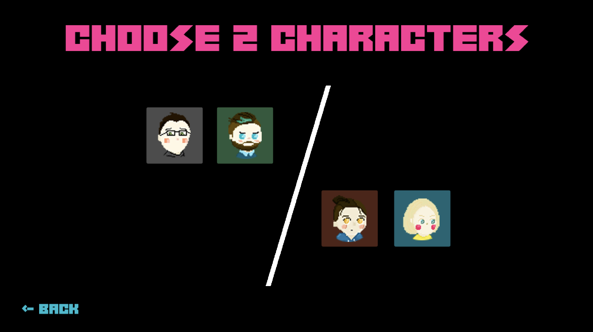
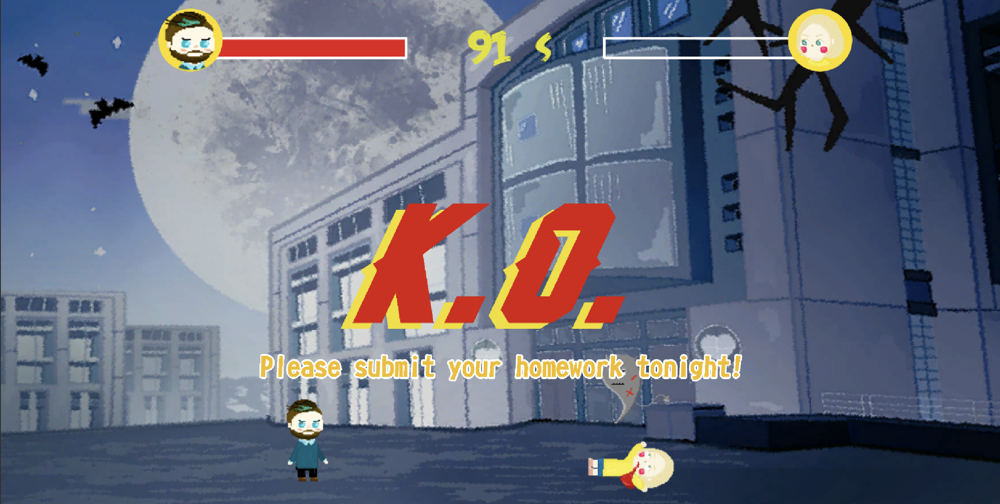
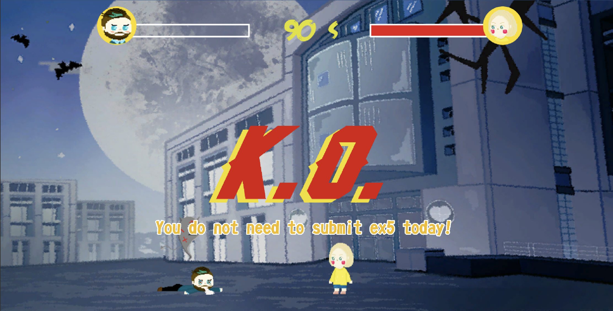

## Press Kit and Trailer

* Press Kit trailer: [Due Tonight Trailer](https://www.youtube.com/watch?v=FFGYx54-IqI)
* Because Due Tonight is a fighting game, the trailer shows the fundamental gameplay scenes. And I also chose to include
unique attack skills in the trailer as the main part. I used QuickTime Player to screenrecord the game and used Adobe Premiere to cut and combine those clips. The background music of the trailer is the same with the background music of our game, which I think is very appealing. The trailer starts with some special audios of our game. Thanks for all the audio contributors for our game!
* For more press kit materials, I will choose to describe the narrative design of our game, the core game mechanics, and include the image of our game art. These are the most attractive part of our game.
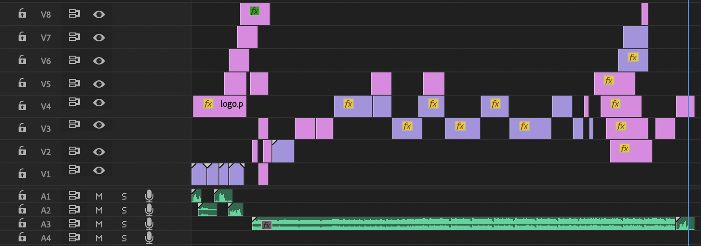

## Game Feel

* Our game is related to students' life in UC Davis, which has been described in Narrative Design. From the visual arts to the sound effects, player from UCD can feel the connection to their daily lives. Overall the game feel is great due to the test we did ourselves and the feedback from professor and other students, but we improved the game feel by modifying some damage values of the ability which will make the game balanced, and that would make the player more interested in the game. And we designed the game not requiring high skill for player to play so that not a professional player would enjoy this game as well. For improvement, I would work more on the camera movement which could make the fighting more realistic and cooler.

* After the game testing and summarize from our own gaming experience, we realized that 100 seconds for one round may be too long for our game. Most of the players will end game in less than 50s because one of them dies, and "K.O" always happens. Since we did not finish a perfect damage control and skill management, this might be one of the important parts to improve in the future. 

* We aim to make the gameplay of the movement smooth. Several animations have been applied to different characters. However, because we lack of the knowledge of Unity2D physics, there are still have some weird motions that we do not have time to optimize.
